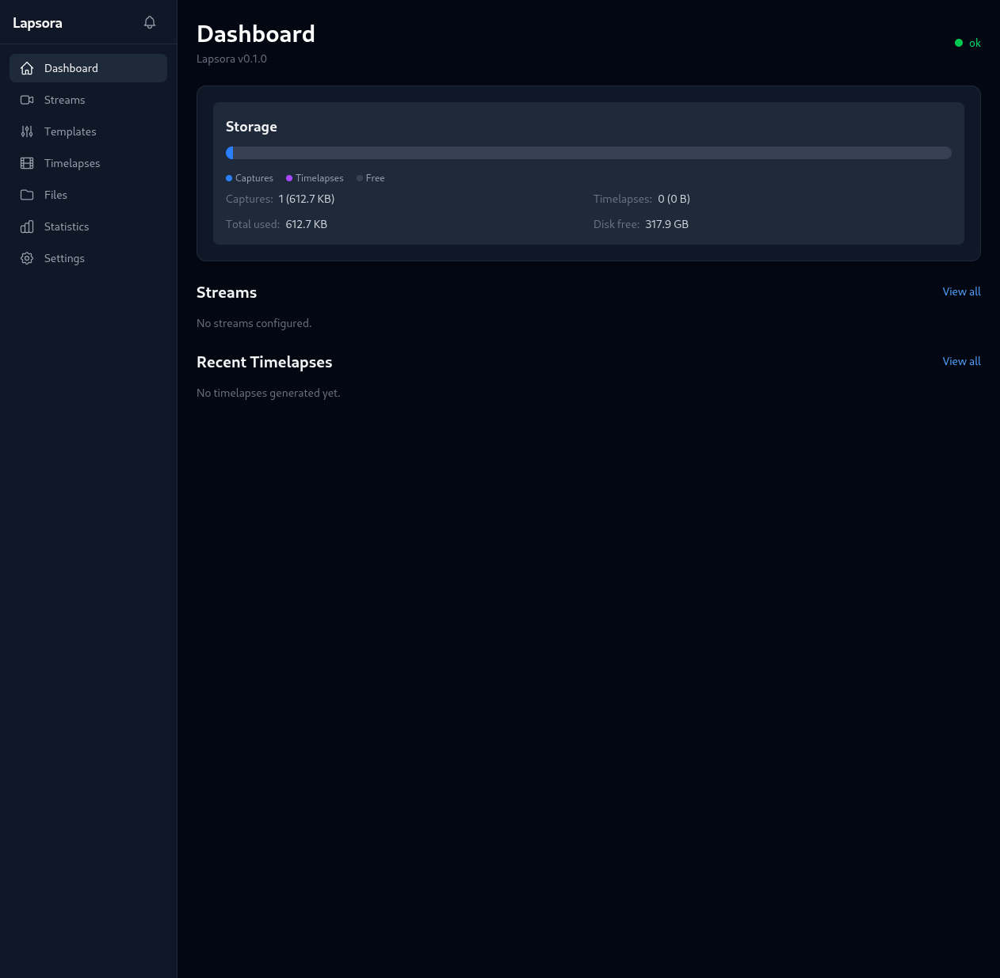
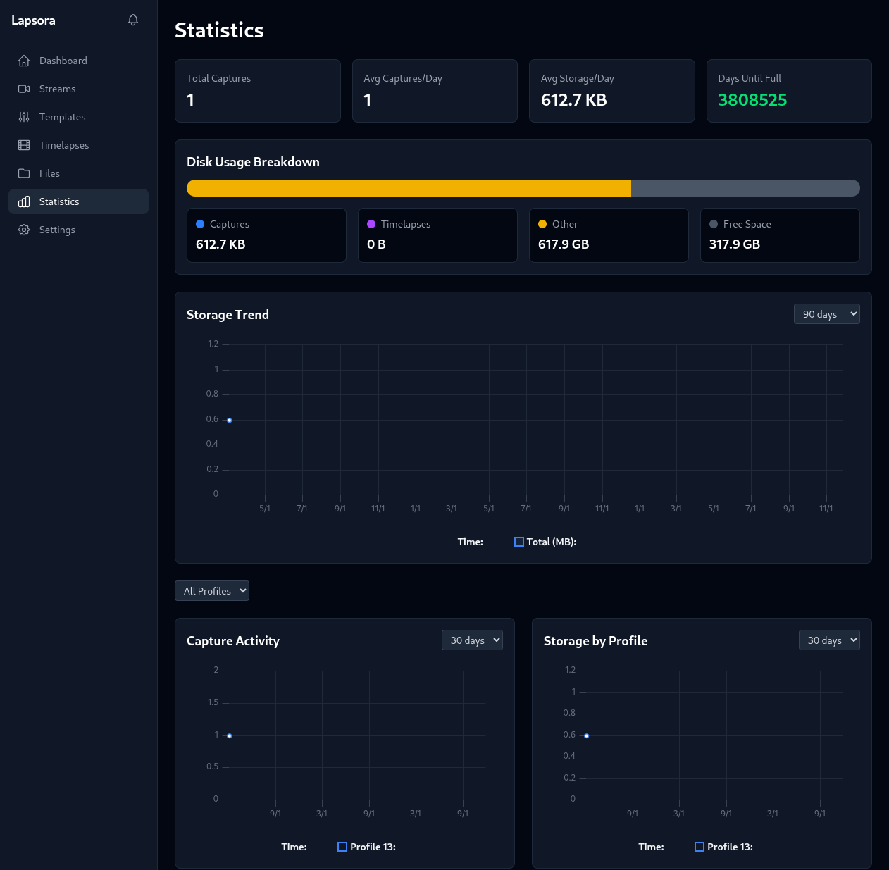
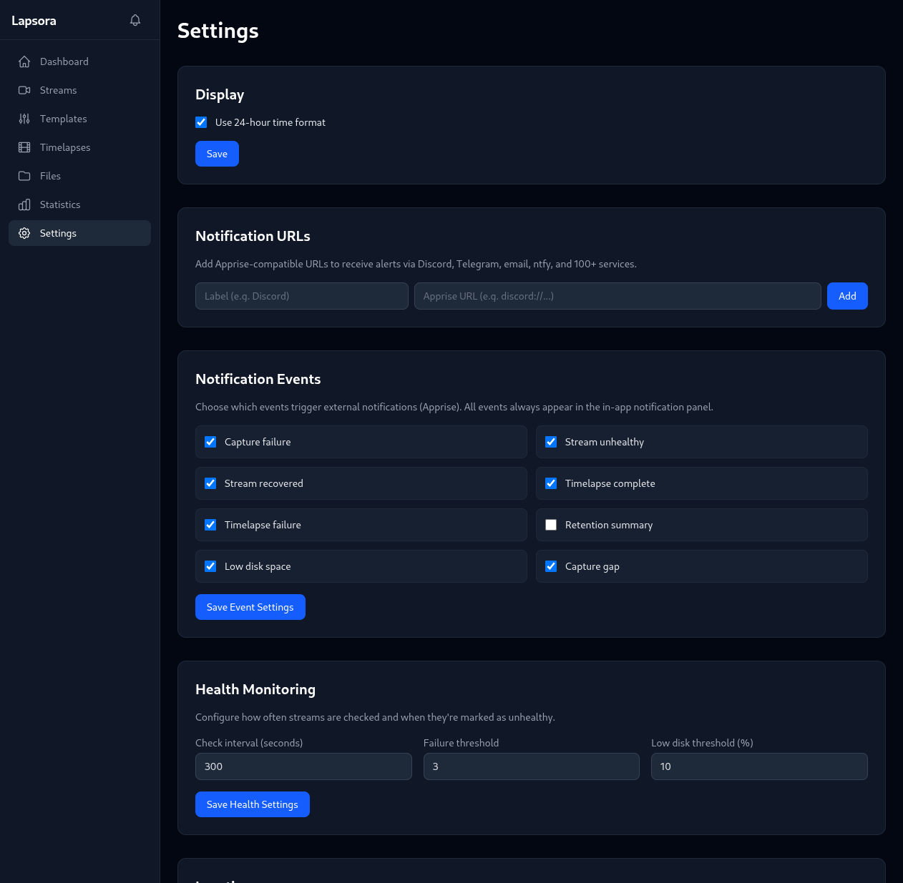
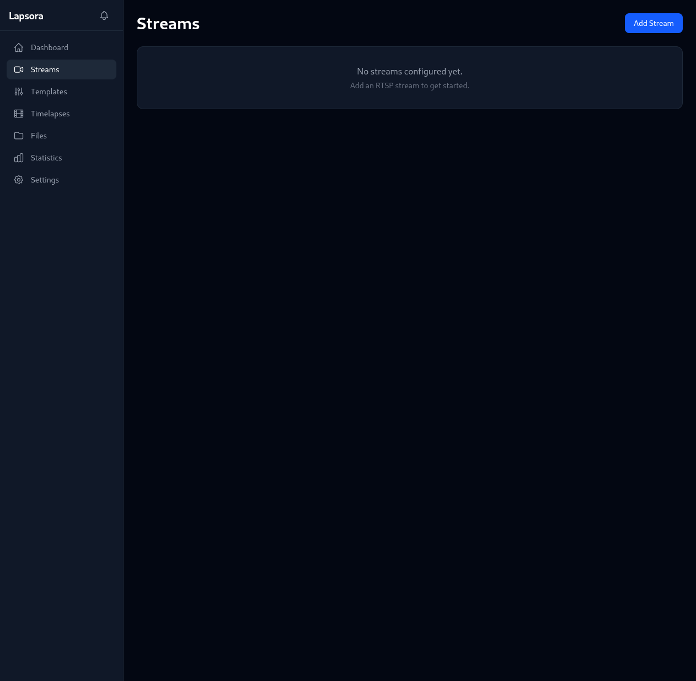

# Lapsora

[](LICENSE)
[](docker/docker-compose.yml)

Self-hosted RTSP timelapse web application. Capture frames from RTSP cameras on a schedule, generate timelapse videos automatically, and manage everything through a modern web UI.

> **Note:** This is a vibecoded project — built iteratively with AI assistance. It works well for its intended purpose, but may have rough edges. Bug reports and feature requests are very welcome via [GitHub Issues](https://github.com/jumpingmushroom/lapsora/issues).

## Screenshots

| Dashboard | Statistics |
|:---------:|:----------:|
|  |  |

| Settings | Streams |
|:--------:|:-------:|
|  |  |

## Features

### Stream Management
- RTSP and [go2rtc](https://github.com/AlexxIT/go2rtc) stream support
- Encrypted credential storage (Fernet encryption)
- Stream health monitoring with configurable failure thresholds
- Live preview and go2rtc WebSocket live view

### Capture System
- Scheduled frame capture at configurable intervals
- HDR / synthetic exposure bracketing with Mertens fusion
- Sun-based scheduling (sunrise/sunset offsets via location settings)
- Weather data integration (OpenWeatherMap)
- Quality control with frame corruption detection
- Capture gap alerting

### Timelapse Generation
- Output formats: MP4, WebM, GIF
- Deflicker processing (luminance curve smoothing)
- Overlay options: timestamps, weather data, heatmap blending
- Motion blur effect
- Codec selection: H.264, H.265, VP8, VP9
- Quality presets (low / medium / high / ultra)
- Generation queue with cancellation support
- Scheduled generation (daily, weekly, monthly, yearly presets or custom cron)

### GPU Acceleration
- NVIDIA NVENC hardware encoding (H.264 / H.265)
- CuPy-accelerated compute for heatmap blending and deflicker

### Notifications
- [Apprise](https://github.com/caronc/apprise) integration — supports ntfy, Discord, Telegram, Slack, email, and [many more](https://github.com/caronc/apprise/wiki)
- 9 configurable event types (capture success/failure, timelapse complete, health alerts, etc.)
- Real-time Server-Sent Events (SSE) for in-app notifications

### Retention & Cleanup
- Cron-based cleanup schedules per profile
- Age-based frame and timelapse deletion
- Orphan file cleanup

### Statistics Dashboard
- Storage usage trends over time
- Capture activity charts
- Per-profile storage breakdown
- Timelapse generation summaries

### Profile Templates
- System and custom preset templates
- Apply templates to quickly create new capture profiles

## Quick Start

### Docker

```bash
# Clone the repository
git clone https://github.com/jumpingmushroom/lapsora.git
cd lapsora

# Configure environment
cp .env.example .env
# Edit .env and set a strong SECRET_KEY

# Start with Docker Compose
docker compose -f docker/docker-compose.yml up -d
```

Open http://localhost:8000 in your browser.

### With GPU Support (NVIDIA)

```bash
docker compose -f docker/docker-compose.yml -f docker/docker-compose.gpu.yml up -d
```

Requires the [NVIDIA Container Toolkit](https://docs.nvidia.com/datacenter/cloud-native/container-toolkit/install-guide.html).

## Configuration

### Environment Variables

Set variables with the `LAPSORA_` prefix (e.g., `LAPSORA_SECRET_KEY`) or in a `.env` file.

| Variable | Default | Description |
|----------|---------|-------------|
| `LAPSORA_SECRET_KEY` | auto-generated | Fernet encryption key for stored credentials |
| `LAPSORA_DATA_DIR` | `data` | Directory for frames, timelapses, and database |
| `LAPSORA_DATABASE_URL` | `sqlite:///data/lapsora.db` | SQLite database path |

### In-App Settings

Configured through the web UI under Settings:

| Setting | Description |
|---------|-------------|
| Location | Latitude/longitude for sun-based scheduling and weather |
| Health Check | Failure thresholds and monitoring intervals |
| Notifications | Apprise URLs and per-event toggles |
| go2rtc | Server URL for go2rtc integration |
| Time Format | 12-hour or 24-hour display |
| Capture Gap Alerting | Alert when captures are missed |

## Architecture

Single Docker container running:

- **[FastAPI](https://fastapi.tiangolo.com/)** — REST API backend serving the built frontend
- **[SvelteKit 5](https://svelte.dev/)** (Svelte 5 runes) — Responsive dark-themed web UI with Tailwind CSS
- **[SQLite](https://sqlite.org/)** — Metadata and configuration storage
- **[APScheduler](https://apscheduler.readthedocs.io/)** — Capture scheduling, timelapse generation, and cleanup jobs
- **[FFmpeg](https://ffmpeg.org/)** — RTSP frame capture and video encoding
- **[OpenCV](https://opencv.org/)** — HDR processing, deflicker, heatmap generation

## API Reference

All endpoints are under `/api`. Full CRUD is available for most resources.

| Area | Endpoints | Description |
|------|-----------|-------------|
| System | `GET /health`, `GET /storage`, `GET /system/info` | Health, storage stats, GPU info |
| Generation Queue | `GET /generations/active`, `GET /generations/queue`, `DELETE /generations/{id}` | Monitor and cancel timelapse generation |
| Streams | `CRUD /streams/`, `POST /streams/{id}/test`, `GET /streams/{id}/preview` | Stream management, testing, preview |
| Profiles | `CRUD /streams/{id}/profiles`, `POST /profiles/{id}/enable`, `POST /profiles/{id}/disable` | Capture profile management |
| Captures | `GET /profiles/{id}/captures`, `GET /captures/{id}/image`, `DELETE /captures/{id}` | Frame management |
| Timelapses | `GET /timelapses`, `POST /profiles/{id}/timelapses/generate`, `GET /timelapses/{id}/video` | Timelapse management and generation |
| Timelapse Schedules | `CRUD /timelapse-schedules/`, `POST /timelapse-schedules/{id}/trigger` | Automated generation schedules |
| Cleanup Schedules | `CRUD /cleanup-schedules/`, `POST /cleanup-schedules/{id}/trigger` | Retention policy management |
| Profile Templates | `CRUD /profile-templates/`, `POST /profile-templates/{id}/apply` | Preset templates |
| Notifications | `GET /notifications/`, `GET /notifications/stream` | Notification history and SSE |
| Settings | `GET|PUT /settings/location`, `GET|PUT /settings/notifications`, etc. | App configuration |
| Statistics | `GET /statistics/summary`, `GET /statistics/storage-trend`, etc. | Dashboard data |

## Development Setup

**Backend:**
```bash
cd backend
python -m venv .venv
source .venv/bin/activate
pip install -e .
uvicorn app.main:app --reload
```

**Frontend:**
```bash
cd frontend
npm install
npm run dev
```

The frontend dev server proxies API requests to the backend at localhost:8000.

## Contributing

See [CONTRIBUTING.md](CONTRIBUTING.md) for guidelines.

## License

This project is licensed under the [GNU Affero General Public License v3.0](LICENSE).
